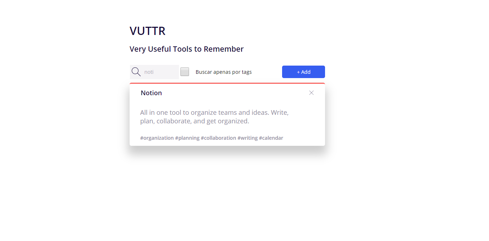
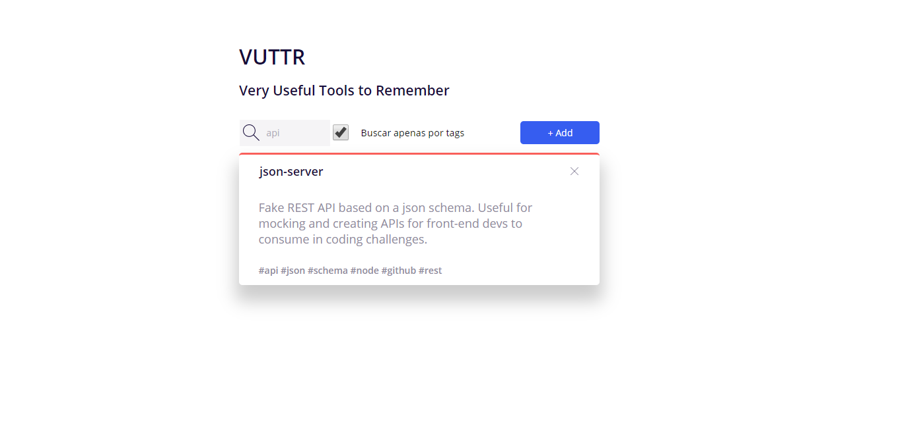
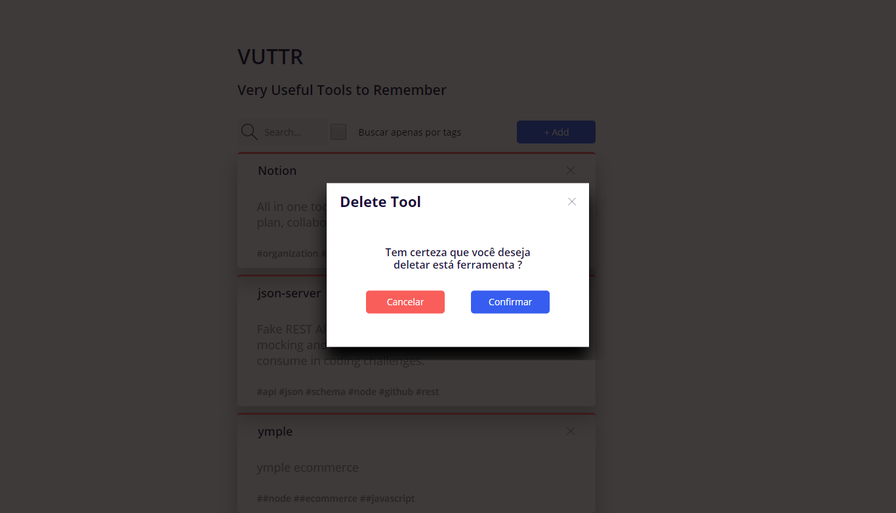
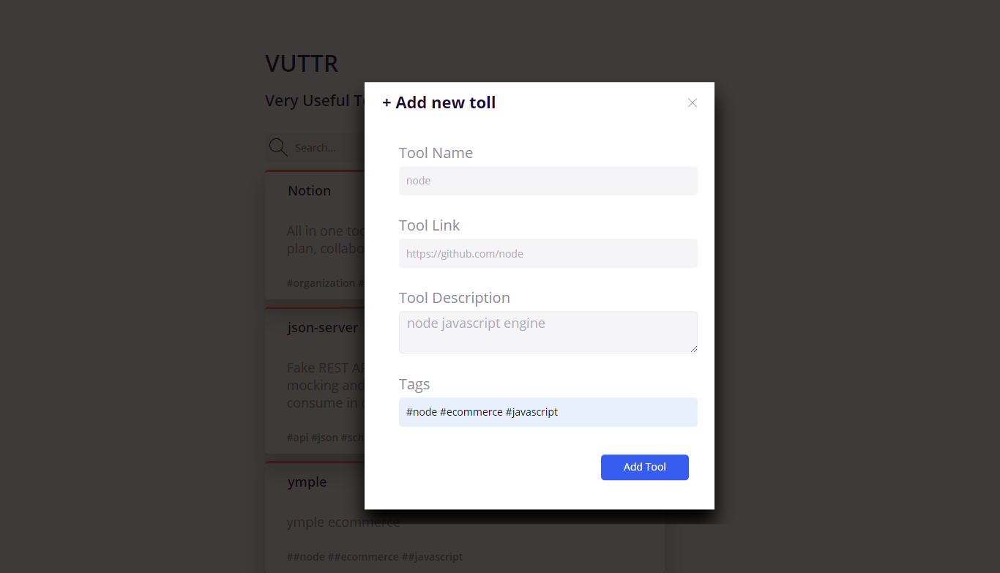

# VUTTR-React JS

Desafio front-end bossabox de construir uma aplicação simples para gerenciar ferramentas com seus respectivos nomes, links, descrições e tags. Pode ser construído utilizando qualquer framework JavaScript de sua preferência, no meu caso React JS.

## Guia de instalação

Instale o node e as dependências necessárias e também a fake-api fornecida pela BossaBox. Neste tutorial daremos preferência ao uso do yarn para instalar a aplicação.

##Como instalar
Clone este repositório:

```bash
git clone https://github.com/130591/Vuttr.git
```

Entre na pasta e instale as dependências:

```bash
cd vuttr-app && yarn install ou npm install
```

## Funcionalidades

Filtrar ferramentas pelo título



Filtrar ferramentas por tags.



Deletar uma ferramenta existente.



Criar uma ferramenta.



## Contributing

Pull requests are welcome. For major changes, please open an issue first to discuss what you would like to change.

Please make sure to update tests as appropriate.

## License

[MIT](https://choosealicense.com/licenses/mit/)
